# Data Preparation, Data Warehouses, and Data Visualization for BI

## Overview

This script processes raw CSV data files by performing data cleaning operations such as standardizing column names, handling missing data, removing duplicate records, and generating reports on the cleaning process. The cleaned data is saved in a designated directory, and reports are generated to summarize changes made. These prepared files can then be loaded into a database for further analysis.

## Features

- Installing Required Libraries
- Setting up important files
- Running an initial Python script
- Checks data consistency before and after cleaning
- Handles missing data by filling or dropping values
- Removes duplicate records
- Saves cleaned data into a specified folder
- Generates and saves reports summarizing data cleaning steps
- Logs errors and saves error reports if issues occur
- Creates database from prepared files

## Installation

Requires installation of:  
pandas  
matplotlib  
loguru  
numpy  
scipy  
sqlite3

```shell

py -m pip install -r requirements.txt

```

## Clone the Repository

```shell
git clone https://github.com/BethSpornitz/smart-store-bethspornitz
```

## Create Project Virtual Environment

On Windows, create a project virtual environment in the .venv folder.

```shell
py -m venv .venv
.venv\Scripts\Activate

```

## Usage

Run the script using:

```shell
python scripts/data_preparation/data_prep2.py

This will process the following raw data files:

data/raw/customers_data.csv

data/raw/products_data.csv

data/raw/sales_data.csv
```

Run the script to create the database using:

```shell
python scripts/etl_to_dw.py

This will create the database using the prepared files
```

## Output

Cleaned files will be saved in data/prepared/.

Reports summarizing data cleaning steps will be saved in data/reports/.

Error reports (if any issues occur) will also be saved in data/reports/.

Using etl_to db script: Database with prepared data will be populated.

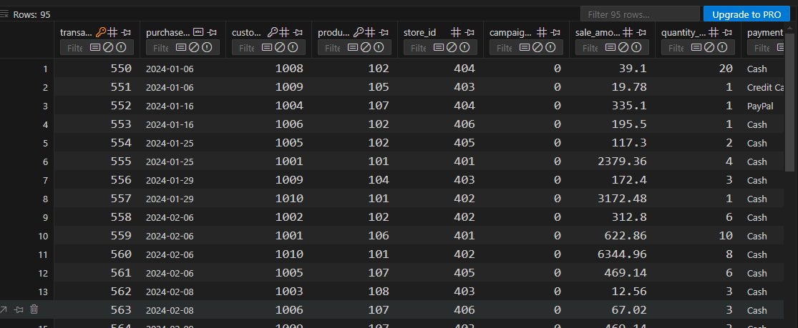

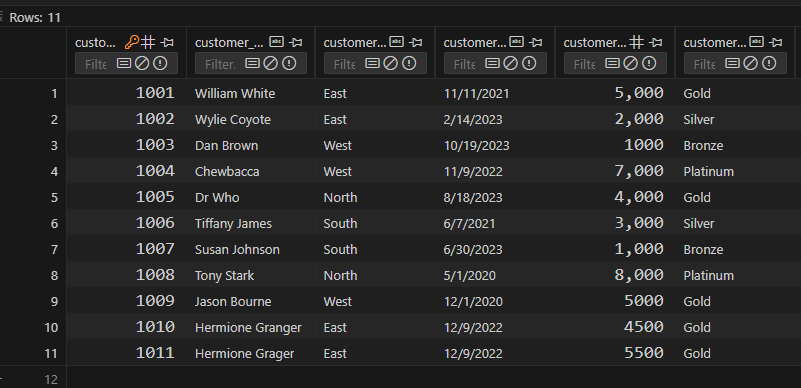

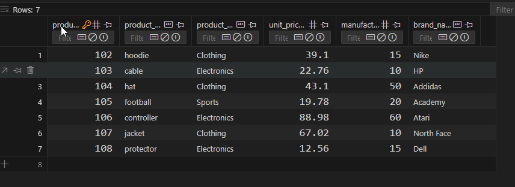

## Logging

The script logs important steps and errors using Python's logging module. Log messages include:

Consistency check results

Paths of saved cleaned files

Report file paths

Error messages (if any occur during processing)

## Dependencies

Python 3.x

pandas

logging

unittest

## Visualization

SQL Queries

```shell

SQL Queries and Reports

Top Customers Query
sql
SELECT c.customer_name AS customer_name, SUM(s.sale_amount_usd) AS TotalSpent
FROM sale s
JOIN customer c ON s.customer_id = c.customer_id
GROUP BY c.customer_name
ORDER BY TotalSpent DESC;
```

Top Customers Bar Chart
Highlights the most valuable customers by total revenue.

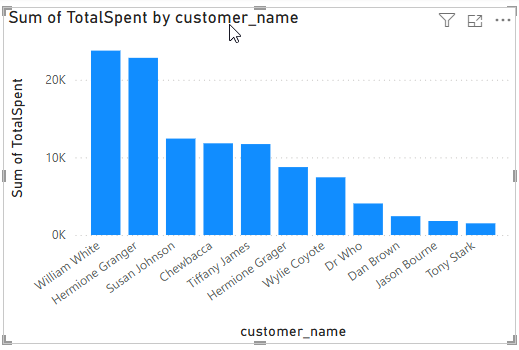

Sales Trends Line Chart
Shows how sales evolve over time, using purchase_date.

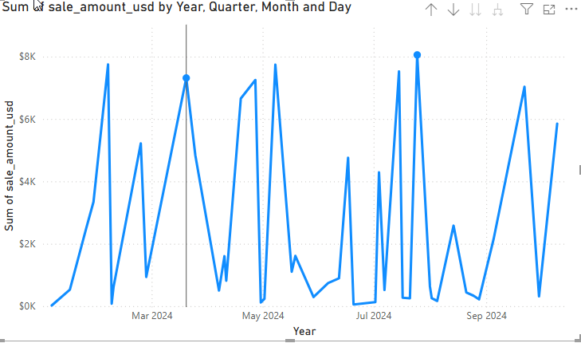

Slicer for Product Category
Enables users to filter all charts by product category.

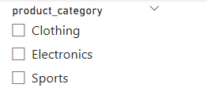

Matrix for Product vs Regio
Cross-tabulates total sales by product_name and customer_region.

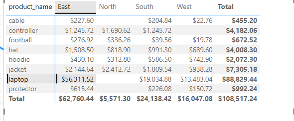

Power BI Model View

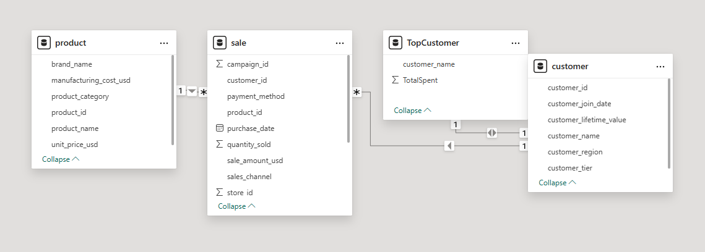

## OLAP and Business Goals

### Section 1. The Business Goal

Business Goal: Identify which customer regions generate the highest total sales for each product category, month-by-month.

Understanding which regions consistently perform best allows leadership to focus marketing efforts, tailor promotions, and optimize inventory distribution by region and category.

* Descriptive dimensions: product category, region, month
* Numeric metric: total sales amount
* Aggregations: sum and average
* Slicing: by product category
* Dicing: by product and region
* Drilldown: from year to month

### Section 2. Data Source

Source: Tables in our SQLite database (smart_sales.db).

Tables Used:

* customer – for region information (customer_region)
* product – for product category (product_category)
* sale – for sale amounts and purchase dates (sale_amount_usd, purchase_date)

Columns:

* sale.purchase_date
* sale.sale_amount_usd
* customer.customer_region
* product.product_category

Join data using foreign keys (customer_id and product_id) to perform analysis.

Sort or filter to identify which regions are top-performing per category per month

Output:

* A line chart to show monthly sales trends
* A bar chart to compare total sales by region and product category
* A summary table of sales totals by region and category

### Section 3. Tools

Python: Data processing, querying, and analysis

* SQLite: Local data storage and relational joins
* Pandas: Data aggregation and transformation
* Plotly & Dash: Interactive data visualizations and dashboards
* Jupyter Notebook: Workflow execution and documentation

### Section 4. Workflow & Logic

Data Preparation:

* Load the SQLite database and joined sale, product, and customer tables.
* Group data by customer_region, product_category, and sale_month.
* Aggregate monthly total_sales using SUM(sale_amount_usd).

Dimensions:

* customer_region
* product_category
* sale_month

Metrics:

* SUM(sale_amount_usd) as total_sales

OLAP Operations:

* Slicing: Filter by product_category
* Dicing: Compare across region and month
* Drill-down: View trends from aggregated monthly totals

### Section 5. Results

Key Findings:

* The East region dominates in sales across all months, especially in Electronics, totaling over $58,000.

* The South region is the second-highest contributor, showing solid performance in both Electronics and Clothing.

* The West region performs moderately across all categories.

* The North region lags behind, with the lowest total sales.

Visualizations Created:

Top Region per Product Category
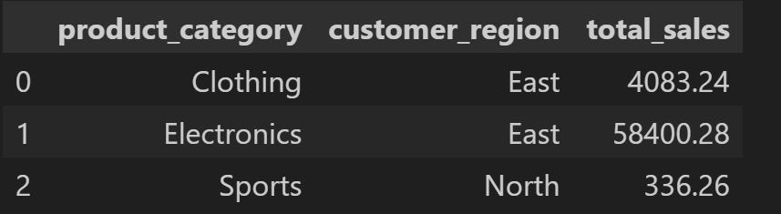

Month with Highest Sales per Region
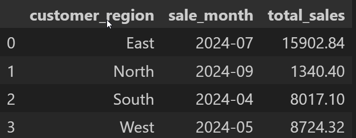

Pivot Table

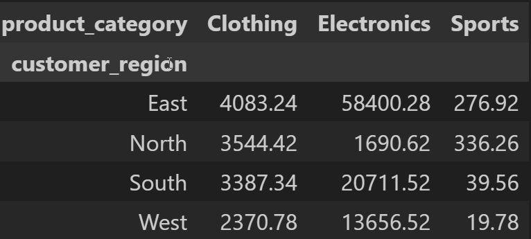

Bar Plot: Total Sales by Region and Product Category
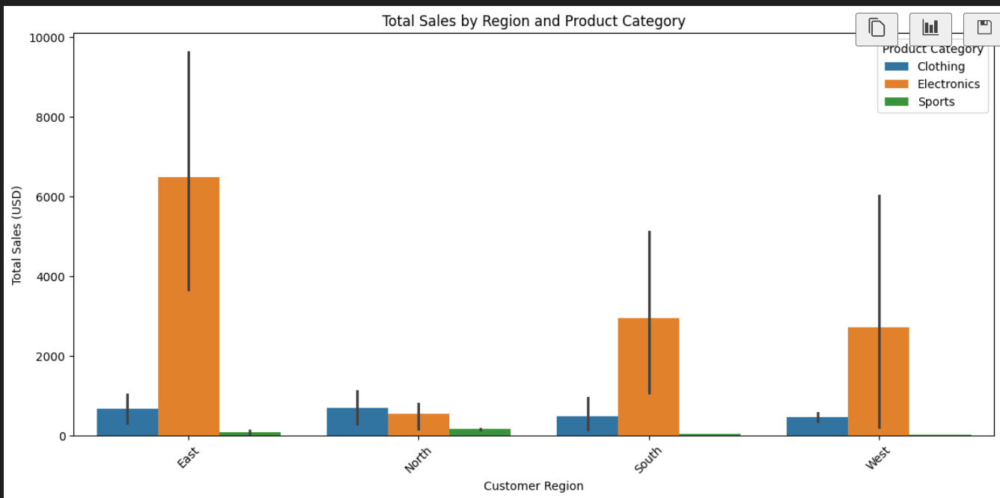

Line Chart: Sales Trends by Month (Faceted by Region)
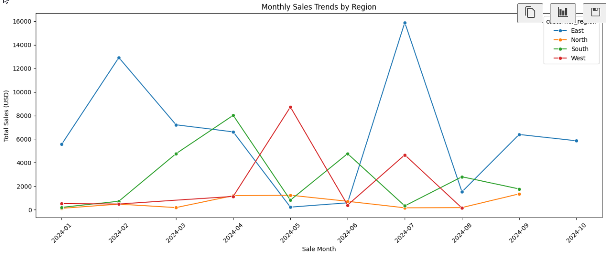

Heatmap: Region vs Product Category by Total Sales
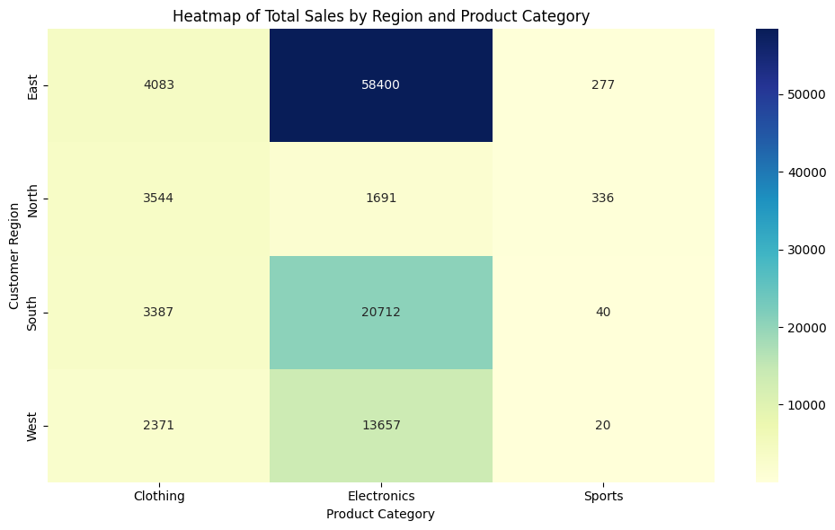

Interactive Bar Chart: Total Sales by Region and Product Category
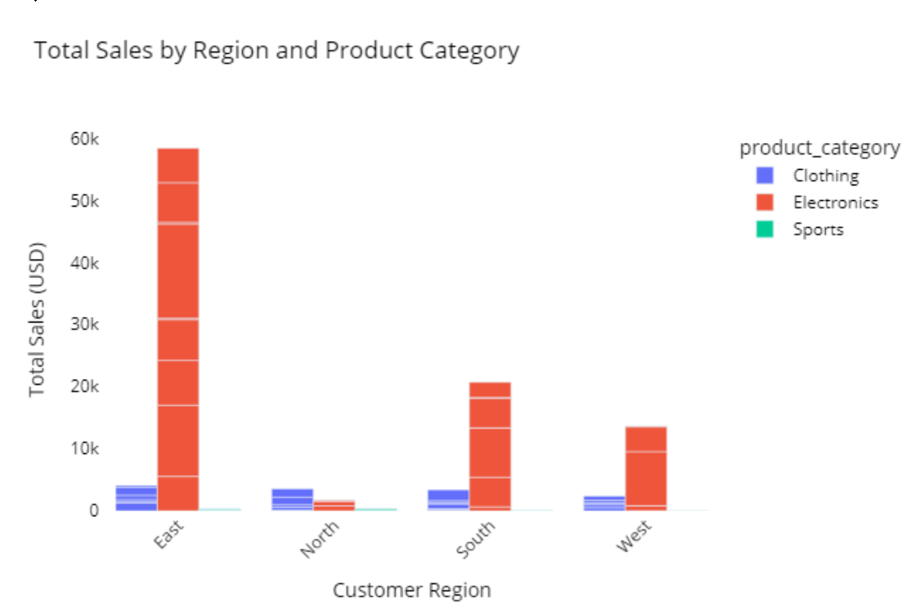

Interactive Line Chart: Monthly Sales Trend by Region
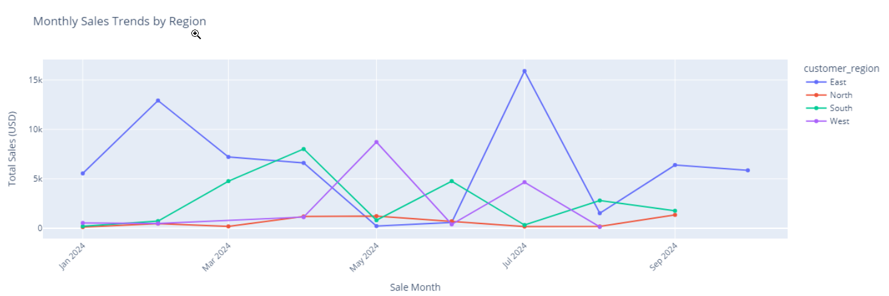

Interactive Faceted Line Chart: Monthly Sales by Product Category
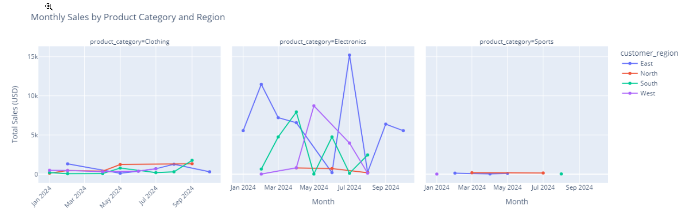

Interactive Line Chart: Monthly sales trends by region and product category (with dropdown filters)
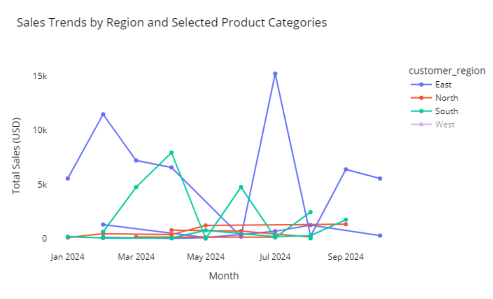

### Section 6. Suggested Business Action

* Invest more in marketing and product placement in the East and South regions, particularly for high-performing categories like Electronics.

* Consider regional promotions or campaigns in the North region to boost performance.

* Use monthly sales trends to plan inventory and staffing based on predictable peak months.

### Section 7. Challenges

I had issues with the interactive visualizations built with Plotly were not appearing in exported HTML.

My solution was to Rebuild some visualizations using Dash, which shows correctly in HTML and maintains interactivity.

I had an issue at the beginning where sale_month appeared duplicated in early line charts.

My solution was to aggregate values by customer_region, product_category, and month to remove duplication.

When creating some visuals in Dash, I had some greyed-out backgrounds.

My solution was to pdate layout and styling in Dash for clear visuals and accessibility.

## Git add and commit

```shell
git add .
git commit -m "add .gitignore, cmds to readme"
git push origin main
```
